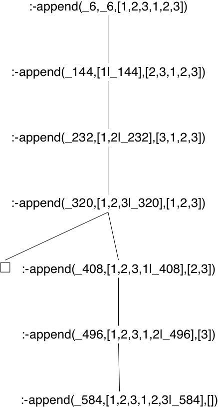
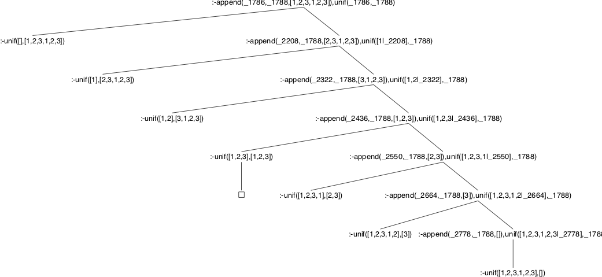

# prolog-xpce-sldtree
Wizualizacja SLD-drzewa.

## Uruchamianie

Należy zaimportować moduł **sld_tree**. Eksportuje on jednoargumentowy predykat __sld_tree/1__, którego argumentem jest zadany cel. Cel powinien korzystać tylko z predykatów zdefiniowanych w postaci klauzul (wywołanie predykatów zdefiniowanych w C, takich jak np. __=/2__, __!/0__ czy __is/2__ zakończy się błędem wykonania).

```prolog
?- use_module(sld_tree).
?- use_module(library(lists)).
?- sld_tree(append(X, Y, [1, 2, 3, 4])).
% SLD-drzewo zapisano w pliku: sldtree1.eps
```

## Przykłady

### cel: append(X, X, [1, 2, 3, 1, 2, 3])

Sprawdźmy czy lista `[1,2,3,1,2,3]` jest konkatenacją dwóch identycznych list:

```prolog
?- sld_tree(append(X, X, [1, 2, 3, 1, 2, 3])).
% SLD-drzewo zapisano w pliku: sldtree1.eps
```

Drzewo z pliku **sldtree1.eps** przedstawiono na poniższym rysunku:



### cel: append(X, Y, [1, 2, 3, 1, 2, 3]), X = Y

Jeszcze raz rozpatrzmy zadanie z poprzedniego przykładu ale tym razem rozerwiemy listę `[1, 2, 3, 1, 2, 3]` na dwa kawałki `X` oraz `Y` i sprawdzimy czy są identyczne dopiero po rozerwaniu.

W tym celu zdefiniujemy predykat `unif/2` wykonujący unifikację:
```prolog
unif(X, X).
```

Zadajemy Prologowi pytanie:
```prolog
?- sld_tree((append(X, Y, [1, 2, 3, 1, 2, 3]), unif(X, Y))).
% SLD-drzewo zapisano w pliku: sldtree2.eps
```

Drzewo z pliku **sldtree2.eps** przedstawiono na poniższym rysunku:




